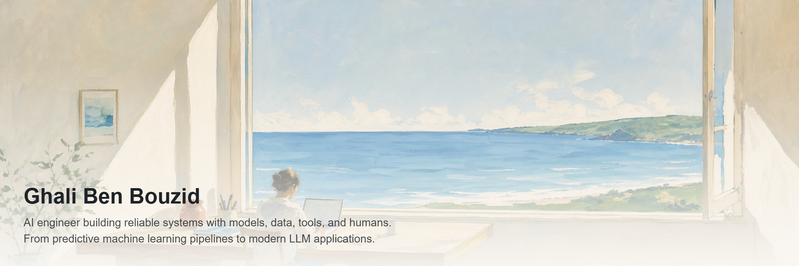

<picture>
  <source media="(prefers-color-scheme: dark)" srcset="assets/banner-dark.png">
  
</picture>

**I'M OPEN TO** &nbsp; *AI Engineer · Machine Learning Engineer · Data Scientist · Applied AI opportunities*

> ### Current direction
> - Building **Cognireply**, a pre-launch AI SaaS product with a three-person team
> - Previously worked as a data scientist on applied machine learning and Earth observation
> - Currently focused on reliable LLM applications, agentic workflows, retrieval, and evaluation

### Selected work

<table>
  <tr>
    <td width="33%" valign="top">
      <h4><a href="https://github.com/Ghali-BenBouzid/sentinel">Sentinel</a></h4>
      
Predictive maintenance: AutoML core, agents that train, monitor, and act.

      
<b>Python · LangGraph</b>

    </td>
    <td width="33%" valign="top">
      <h4><a href="https://github.com/Ghali-BenBouzid/ad-compliance-auditor">Warden</a></h4>
      
Multimodal ad-compliance auditing with retrieval and structured reasoning.

      
<b>Python · LangGraph · Azure AI</b>

    </td>
    <td width="33%" valign="top">
      <h4><a href="https://github.com/Ghali-BenBouzid/nexus">Nexus</a></h4>
      
Multi-agent research assistant: one query in, cited report out.

      
<b>Python · Agents</b>

    </td>
  </tr>
</table>

