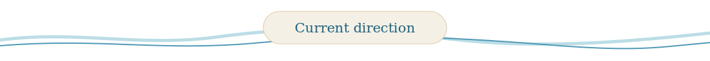
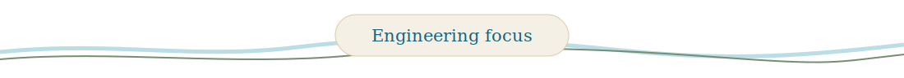
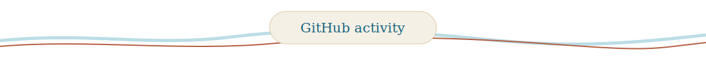

  

<h1 align="center">Ghali Ben Bouzid</h1>

  AI engineer building reliable systems with models, data, tools, and humans. 
  From predictive machine learning pipelines to modern LLM applications.

  
  

- Building **Cognireply**, a pre-launch AI SaaS product with a three-person team
- Previously worked as a data scientist on applied machine learning and Earth observation
- Currently focused on reliable LLM applications, agentic workflows, retrieval, and evaluation
- Open to **AI Engineer**, **Machine Learning Engineer**, **Data Scientist**, and **Applied AI** opportunities

<table width="100%">
  <tr>
    <td width="33%" valign="top">
      <h3><a href="https://github.com/Ghali-BenBouzid/sentinel">Sentinel</a></h3>
      Predictive maintenance combining a deterministic AutoML core with agent orchestration for training, monitoring, reporting, and action.
    </td>
    <td width="33%" valign="top">
      <h3><a href="https://github.com/Ghali-BenBouzid/ad-compliance-auditor">Warden</a></h3>
      A multimodal advertising-compliance pipeline built with LangGraph, Azure AI Search, retrieval, and structured reasoning.
    </td>
    <td width="33%" valign="top">
      <h3><a href="https://github.com/Ghali-BenBouzid/nexus">Nexus</a></h3>
      A multi-agent research assistant that produces cited reports from web sources and uploaded documents.
    </td>
  </tr>
</table>

  
  
  
  
  

  

  Building toward dependable AI systems—one measured iteration at a time.

